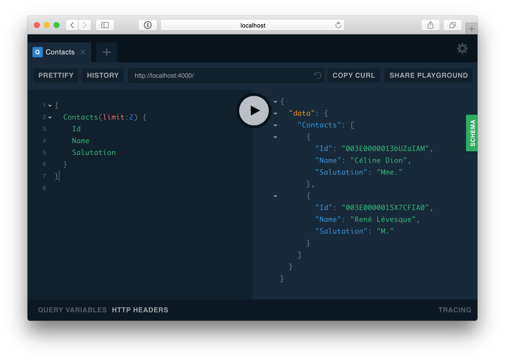

<p align="center">
  
  <br>
  <a href="https://travis-ci.org/jpmonette/salesforce-graphql"></a>
</p>

<p align="center"><code>salesforce-graphql</code> - Bringing the <strong>GraphQL</strong> query language to <strong>Salesforce</strong></p>

## Getting Started

### Installation

```sh
$ yarn add salesforce-graphql jsforce
```

### Example

#### `app.ts`

```ts
import * as jsforce from 'jsforce';
import * as path from 'path';
import * as fs from 'fs';

import { GraphQLServer } from 'graphql-yoga';
import { Binding } from 'salesforce-graphql';

const schemaFile = path.join(__dirname, 'schema.graphql');
const typeDefs = fs.readFileSync(schemaFile, 'utf8');

const { USERNAME, PASSWORD } = process.env;

const resolvers = {
  Query: {
    Accounts: (parent, args, context, info) =>
      context.db.query({}, info).then(res => res.records),
    Account: (parent, args, context, info) =>
      context.db.query({}, info).then(res => res.records[0]),
    Contacts: (parent, args, context, info) =>
      context.db.query({}, info).then(res => res.records),
    Contact: (parentobj, args, context, info) =>
      context.db.query({}, info).then(res => res.records[0]),
  },
};

const conn = new jsforce.Connection({});

function init() {
  const db = new Binding({ conn });

  const server = new GraphQLServer({
    typeDefs,
    resolvers,
    context: req => ({ ...req, db }),
  });

  server.start({ playground: '/playground' }, ({ port }) =>
    console.log('Server is running on localhost:' + port)
  );
}

conn.login(USERNAME, PASSWORD, (err, userinfo) => init());
```

#### `schema.graphql`

```graphql
type Query {
  Account(Id: ID!): Account
  Accounts(limit: Int): [Account]
  Contact(Id: ID!): Contact
  Contacts(limit: Int): [Contact]
}

type Account {
  Id: ID!
  IsDeleted: Boolean
  Name: String
  Type: String
}

type Contact {
  Id: ID!
  AccountId: String
  LastName: String
  FirstName: String
  Salutation: String
  Name: String
}
```

When you are ready, start the GraphQL server:

```sh
$ yarn start
```

Head over to `http://localhost:4000/playground` to test with the following query:

```graphql
{
  Contacts(limit: 2) {
    Id
    Name
    Salutation
  }
}
```



## TODO

* Subscriptions
* Mutations
* Basically everything

## References

- [`salesforce-graphql` on NPM](https://www.npmjs.com/package/salesforce-graphql)
- Learn more about [GraphQL](http://graphql.org/)
- [Salesforce REST API](https://developer.salesforce.com/docs/atlas.en-us.api_rest.meta/api_rest/intro_what_is_rest_api.htm) documentation